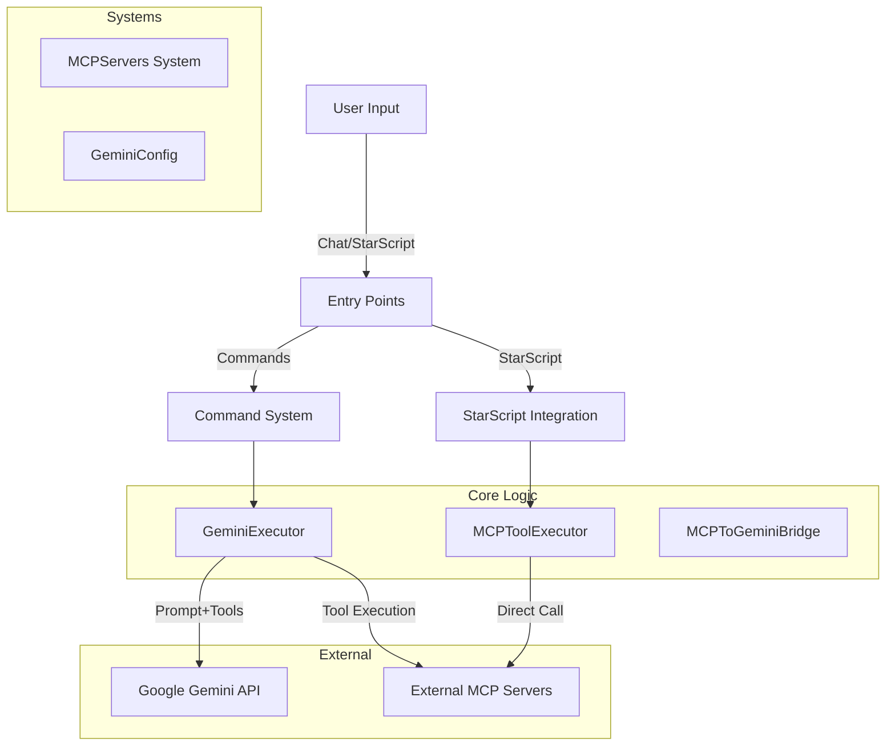

# Meteor MCP Addon - Comprehensive Documentation

## 1. Project Overview

**Meteor MCP Addon** is a specialized modification for the **Meteor Client** (Minecraft Fabric mod). It serves as a bridge between the Minecraft client and the **Model Context Protocol (MCP)** ecosystem, enhanced by **Google's Gemini AI**.

**Core Purpose:**
1.  **Connect:** Link Minecraft to external MCP servers (local or remote).
2.  **Expose:** Make MCP tools available as StarScript functions (`{server.tool()}`).
3.  **Automate:** Use Gemini AI to intelligently orchestrate these tools via natural language (`/gemini-mcp`).

## 2. Architecture & Data Flow

### 2.1 System Hierarchy



### 2.2 The "Enhanced" Gemini Flow (`/gemini-mcp`)

When a user executes `/gemini-mcp "Get weather in Tokyo"`, the following sequence occurs in `GeminiExecutor`:

1.  **Tool Collection:** The system retrieves all connected MCP servers and converts their tools into Gemini-compatible `FunctionDeclaration` objects using `MCPToGeminiBridge`.
2.  **Initial Request:** The prompt and tool definitions are sent to the Gemini API.
3.  **The Loop (Manual Function Calling):**
    *   **Gemini Response:** The AI may respond with text (done) or a `FunctionCall` request.
    *   **Routing:** If a function is called (e.g., `weather_get_forecast`), `MCPToGeminiBridge` parses this name to identify the target server (`weather`) and tool (`get_forecast`).
    *   **Execution:** The tool is executed via `MCPServerConnection.callTool()`.
    *   **Recursion:** The tool's output is added to the chat history, and the updated history is sent back to Gemini.
    *   *Limit:* This loop repeats up to 6 times to allow for multi-step reasoning.
4.  **Final Output:** The final text response is returned to the user.

### 2.3 StarScript & Async Execution

StarScript runs on the **Render Thread**, meaning any blocking operation freezes the game. To solve this, `MCPToolExecutor` implements a **non-blocking cache-and-fetch pattern**:

1.  **Call:** User writes `{time.now()}` in a HUD element.
2.  **Check:** `MCPToolExecutor` checks `MCPAsyncResult` cache for a result key (server + tool + args).
3.  **Return:** It *immediately* returns the last known result (or "Loading..." if first run).
4.  **Fetch:** A background task is triggered on `MeteorExecutor` to call the actual MCP server.
5.  **Update:** When the MCP server responds, the cache is updated. The *next* frame's render will show the new data.

## 3. Key Components

### 3.1 Systems & Persistence

*   **`MCPServers`**: The central registry. It manages `MCPServerConnection` objects and persists configuration to `mcp-servers.nbt`.
*   **`GeminiConfig`**: Stores AI settings.
    *   **API Key:** Encrypted (basic XOR) in NBT.
    *   **Model:** Enum-based selection (e.g., `GEMINI_2_5_FLASH`).
    *   **Tokens/Temp:** Generation parameters.

### 3.2 Gemini Integration

*   **`GeminiExecutor`**: Stateless utility class containing the core "Prompt Loop" logic.
*   **`MCPToGeminiBridge`**: A translator class.
    *   *Input:* MCP `Tool` schema.
    *   *Output:* Gemini `FunctionDeclaration`.
    *   *Logic:* Prefixes tool names with server names (e.g., `weather_get_forecast`) to prevent collisions and allow routing.

### 3.3 GUI

*   **`MCPServersScreen`**: The main hub for managing connections.
*   **`GeminiSettingsScreen`**: Dedicated config screen for API keys and models.

## 4. Usage Guide

### 4.1 Connecting a Server
1.  Open Meteor GUI (`Right Shift`) -> **MCP** Tab.
2.  Click **Add Server**.
3.  Command: `npx -y @modelcontextprotocol/server-time` (or any other MCP server).
4.  Name: `time` (This becomes the StarScript namespace).

### 4.2 StarScript Syntax
Once connected, tools are available globally:
*   `{time.get_current_time("UTC")}`
*   `{weather.get_forecast("London", 3)}`

### 4.3 Chat Commands
*   `/gemini "Explain quantum physics"` (Simple text)
*   `/gemini-mcp "Check the weather in London and tell me if I need an umbrella"` (Uses connected tools)
*   `/time:get_current_time timezone="UTC"` (Auto-generated command for specific tool)

## 5. Development

### 5.1 Setup
```bash
git clone https://github.com/cope/meteor-mcp-addon
cd meteor-mcp-addon
./gradlew build
```

### 5.2 Adding New Features
*   **New StarScript Functions:** Register in `GeminiStarScriptIntegration`.
*   **New Config Options:** Update `GeminiConfig` and `GeminiSettingsScreen`.
*   **New Logic:** Modify `GeminiExecutor` for changes to the AI loop.

### 5.3 Common Issues
*   **"Server Disconnected":** Check the console logs. The MCP server process might have crashed or failed to start (e.g., missing `node` in PATH).
*   **Gemini 400 Errors:** Usually invalid tool schemas. `MCPToGeminiBridge` attempts to sanitize schemas, but complex JSON types might need adjustment.
*   **Render Thread Lag:** Ensure `MCPToolExecutor` never calls `connection.callTool()` directly on the main thread.

## 6. Troubleshooting & Debugging

*   **Logs:** All addon logs are prefixed with `[Meteor MCP]`.
*   **Connection Issues:** If a server stays "Connecting...", verify the command runs in a normal terminal.
*   **AI Hallucinations:** If Gemini calls non-existent tools, check `MCPToGeminiBridge` logic to ensure schemas are being converted correctly.